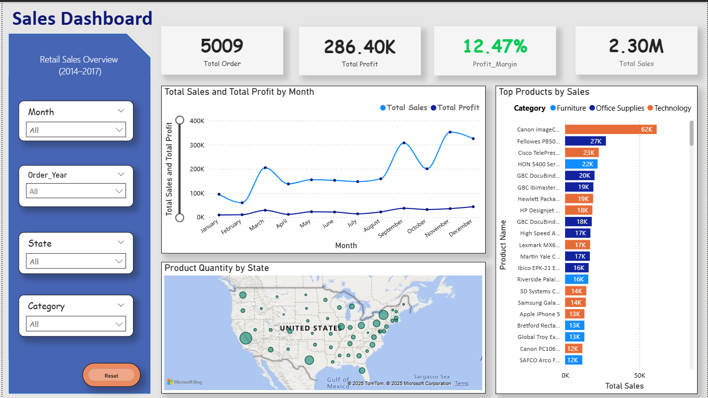

# 🧠 RetailVisor – Sales Analytics Dashboard using Power BI

RetailVisor is a professional business intelligence dashboard designed using Power BI. It enables users to analyze retail sales data with visual clarity and interactive filters. The dashboard delivers key insights into sales trends, profit analysis, product performance, and state-wise distribution, supporting informed decision-making.

---

## 🚀 Overview

- **Tool**: Power BI Desktop  
- **Purpose**: Analyze sales data and provide insights  
- **Scope**: Track sales, profit, and product trends across regions and categories  
- **Duration**: Four-year data (48 months) - (2014-2017)

---

## 🔧 Tools & Technologies

- Power BI Desktop  
- Microsoft Excel / SQL (for preprocessing)  
- DAX (Data Analysis Expressions)  
- Power BI Map and Custom Visuals

---

## 🗂️ Data Description

| Main Feature     | Description                              |
|------------------|------------------------------------------|
| Order ID         | Unique transaction ID                    |
| Order Date       | Date of order                            |
| Product Category | Furniture, Office Supplies, Technology   |
| State            | U.S. States                              |
| Sales            | Revenue generated                        |
| Profit           | Profit earned                            |
| Quantity         | Number of items sold                     |

---

## 📈 Visualizations

| Visual                          | Purpose                                                                 |
|----------------------------------|-------------------------------------------------------------------------|
| **KPI Cards**                   | Show Total Sales, Profit, Orders, Profit Margin                         |
| **Line Chart**                 | Monthly trend of Sales and Profit                                       |
| **Bar Chart (Horizontal)**     | Top Products by Sales, categorized by Product Category                  |
| **Slicers (Month, Year, State, Category)** | Enable quick filtering of data                              |
| **Conditional Formatting Cards**| Green for good profit margin, Red for poor performance (DAX-based)     |

---

## ✅ Conclusion

RetailVisor successfully converts raw retail data into insightful visuals. The interactive Power BI dashboard equips users to:
- Monitor key performance indicators (KPIs),
- Identify high-performing products and states,
- Adjust strategies based on monthly and category-wise performance.

---

## 🔮 Future Scope

- Connect to live SQL database or cloud APIs  
- Add forecasting for future sales trends  
- Embed dashboard into Power BI Service with scheduled updates  
- Integrate email alerts for critical performance drops

---

## 🖼️ Preview

> 

---

## 👨‍💻 Made with ❤️ by **Vivek** 
 
Final Year Engineering Student – AI & DS  
RetailVisor Project – 2025

